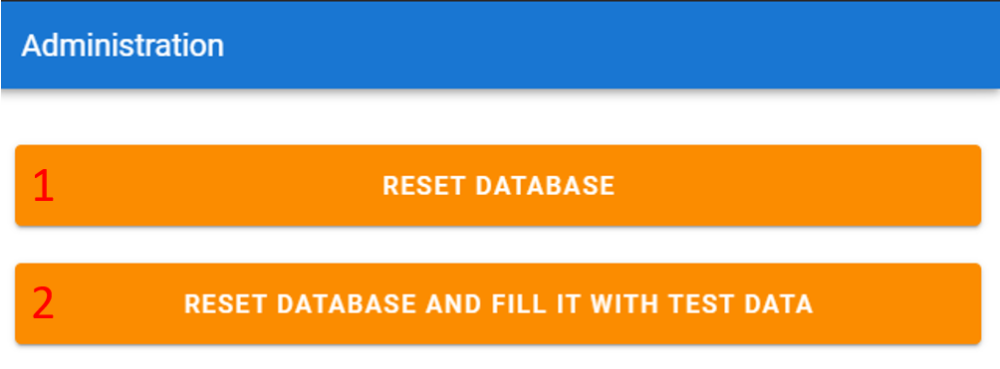

# mini-bookkeeping

mini-bookkeeping is a desktop application that a small business can use to manage their expenses. It was built with Electron, Vue.js and Vuetify. MariaDB (MySQL) is used as a Relational Database Management System. All queries were written in raw SQL, without any ORM.
## Table of contents
* [About](#mini-bookkeeping)
* [Demo](#demo)
* [Technologies](#technologies)
* [Installing](#installing)
* [Database ER diagram](#database-er-diagram)
* [User interface](#user-interface)
   + [Menu bar](#menu-bar)
   + [Data management](#data-management)
   + [Expense report](#expense-report)
   + [Create edit record form](#create-edit-record-form)
   + [Analytics](#analytics)
     - [Queries list](#queries-list)
   + [Administration](#administration)


## Demo
[](https://youtu.be/GEwqHBrK19M)

## Technologies
- [Electron](https://www.electronjs.org/)
- [Vue.js](https://vuejs.org/) 2
- [Vuetify](https://vuetifyjs.com/en/)
- [MariaDB](https://mariadb.org/)


## Installing

1. Install Node.js and npm
2. Install MariaDB or MySQL
3. Create database ```mini_bookkeeping```
4. Clone repository and install dependencies by running next commands:
   ```bash
   git clone https://github.com/valerachuk/mini-bookkeeping
   cd mini-bookkeeping
   npm install
   ```
5. Go to ```./mini-bookkeeping/src/configs```
6. Create a copy of ```db.config.sample.js```
7. Rename it to ```db.config.js```
8. Specify database username and password in ```db.config.js```
9. Run ```npm run electron:serve``` to run or ```npm run electron:build``` to build
10. Open [Administration section](#administration) and click `Reset database` or  `Reset database and fill it with test data` button. Then confirm the action in pop-up 

## Database ER diagram


## User interface

### Menu bar


Menu bar has next structure: 
 - [Data management](#data-management)
    - Employees
    - Departments
    - Shops
    - TypesOfCosts
    - Expenses
 - [Analytics](#analytics)
    - Open Analytics
 - [Administration](#administration)
    - Open Admin Tools

### Data management
Data management allows you to perform CRUD operations for each table.


1. Table records
2. `Create new` button. Opens [form](#create-edit-record-form) to create new records
3. Edit button. Opens [form](#create-edit-record-form) to edit a record
4. Download button. Creates [a report as a HTML file.](#expense-report) Only available for `Expenses`
5. Delete button. Deletes record
6. Pagination

### Expense report
Contains info about an expense


### Create-edit record form
Allows you to create or edit a record from any table in database


### Analytics
Allows you to execute some analytics queries


#### Queries list:

1. Total spent per type of cost
   - Returns total spent per type of cost, ordered by total spent descending. Output columns: TypeOfCostId, TypeOfCostName, TotalSpent.
2. Employees count per department
   - Returns employees count per department, ordered by employees count descending. Output columns: DepartmentId, DepartmentName, EmployeesCount.
3. Top 3 popular shops, by number of expenses
   - Returns popular shops (by number of expenses) ordered by number of expenses descending, limited by 3. Output columns: ShopId, ShopName, NumberOfExpenses.
4. Employee spent the least but more than average
   - Find the employee who spent the least but more than average.Output columns: EmployeeId, FullName, TotalSpent, AvgPrice.
5. Total spend per type of cost in current month
   - Returns total spend per type of cost in current month, ordered by total spent descending. Output columns: TypeOfCostId, TypeOfCostName, ThresholdPerMonth, CurrentSpent.
6. Employees that have ever made a spend for another department
   - Find the employees that have ever made a spend for another department, ordering by their total spend descending. Output columns: EmployeeId, FullName, TotalSpent.

### Administration
Allows you to reset database



1. `Reset database` button. Drops current database and creates a new one with appropriate structure 
2. `Reset database and fill it with test data` button. Drops current database and creates a new one with appropriate structure, then fills it with some test data

